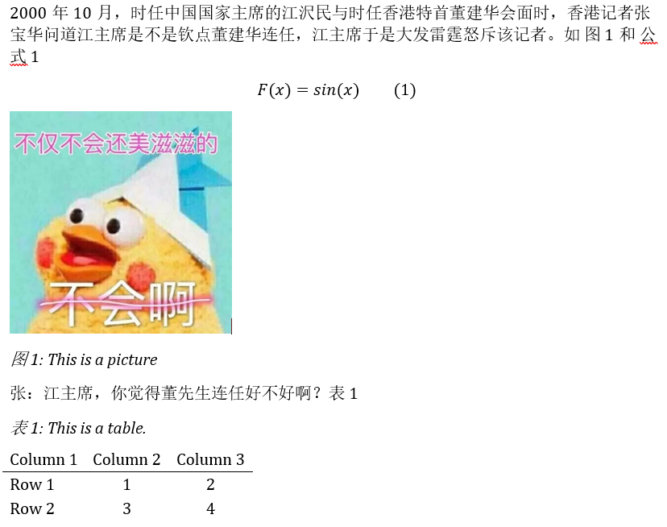

2000 年 10 月，时任中国国家主席的江沢民与时任香港特首董建华会面时，香港记者张宝
华问道江主席是不是钦点董建华连任，江主席于是大发雷霆怒斥该记者。 @fig:fig1
@eq:eq1

$$F(x) = sin(x)$${#eq:eq1}

{#fig:fig1}

张：江主席，你觉得董先生连任好不好啊？@tbl:tab_1

| Column 1 | Column 2 | Column 3 |
| -------- | :------: | :------: |
| Row 1    |    1     |    2     |
| Row 2    |    3     |    4     |

: This is a table. {#tbl:tab_1}
